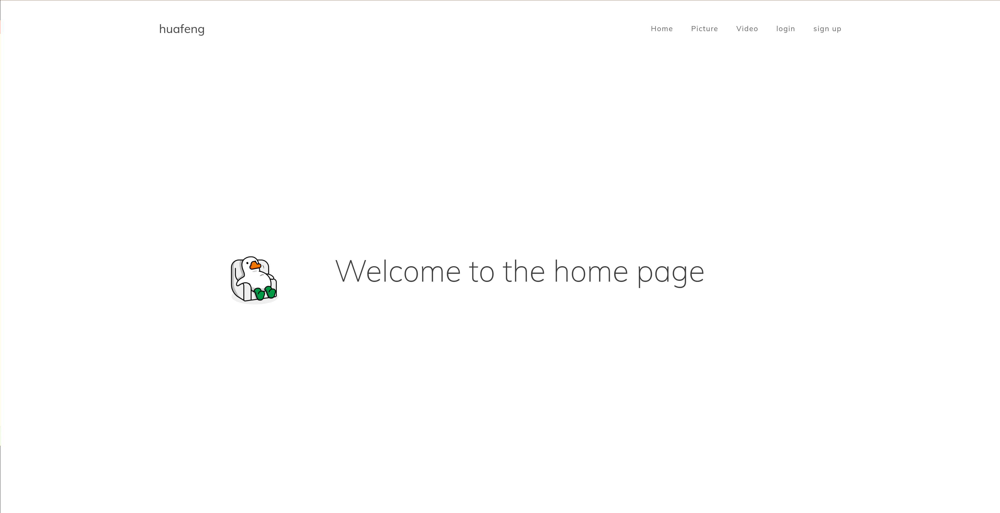

### SuperServer


a high performance server with:
- epoll + Reactor/Proactor = IO
- thread pool, database connection pool
- Synchronous/asynchronous logging systems
- RAII, semaphore, mutex, smart pointers and class templates
- Implementing the http Protocol
#### Project structure
```
|-- src                 source file dir
|-- CMakeLists.txt      cmake file
|-- initServer.sh       init project shell
|-- LICENSE             MIT LICENSE
|-- README.md           
```

#### install & start SuperServer
##### 1. create mysql
```shell
# install mysql
sudo apt install mysql-server
sudo apt install libmysqlclient-dev
# login root
sudo mysql -u root -p
# create database
create DATABASE SuperServer;
# create user
CREATE USER 'huafeng'@'localhost' IDENTIFIED BY 'password';
# grant
GRANT ALL PRIVILEGES ON SuperServer.* TO 'huafeng'@'localhost';
# flush
FLUSH PRIVILEGES;
```
##### 2. install necessary
```shell
sudo apt install cmake gcc 
mysql -u huafeng -p SuperServer < /path/to/user_table.sql
```
##### 3. start Server
```shell
./initServer.sh
./SuperServer
```
#### test
access URL(localhost:1618) to vertify!

#### other
begin init,you need edit src/server/server.cpp:srcDir